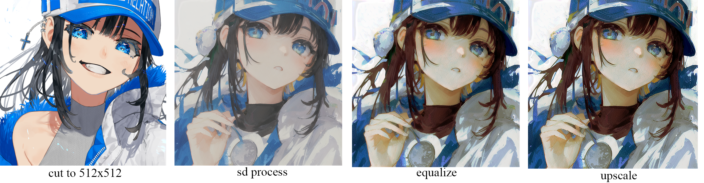
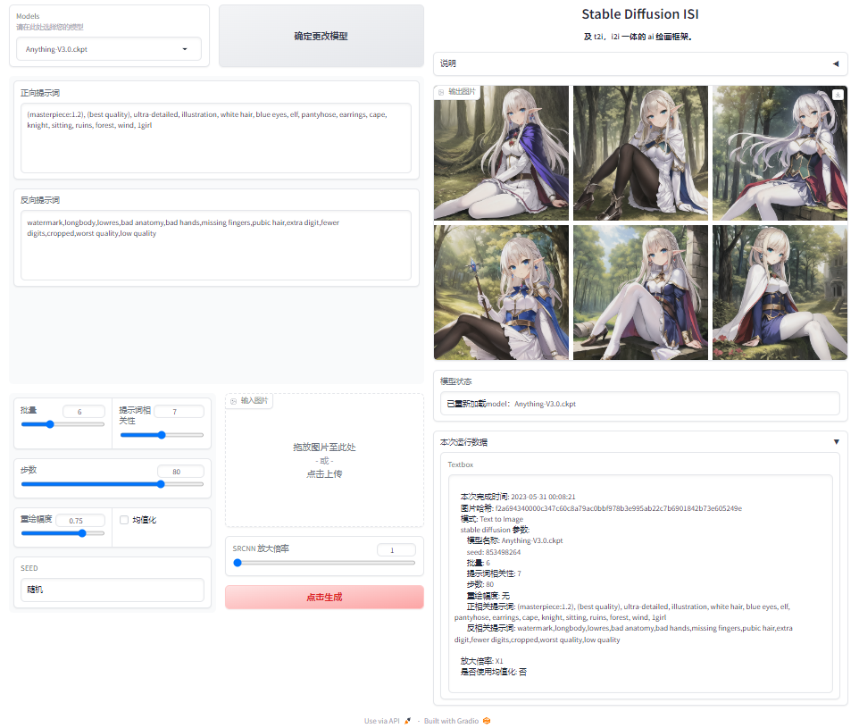

# Stable Difffusion ISI
#### A webui for Stable Diffusion I2I process.

About: This project is my graduation design for my university.

## Effect
裁剪，扩散，均值化，超分辨率后的效果图

* 多批量预览图

## Thanks:

* \[1]: Stabe-Diffusion:
https://github.com/CompVis/stable-diffusion

* \[2]: img2img script:
https://gitee.com/nightaway/automatic111-webui-exts

* \[3]: upscale models and script:
https://github.com/luzhixing12345/image-super-resolution/

## How to run this project?
1. install python (version >= 3.10.8)
2. install the virtual environments and dependences by scripts. If you are living in China, please use "install-environments-GBK.ps1" to install, else you would use "install-environments.ps1" to install.
3. run the "webui.start.ps1" first. When the terminal show address, close it. Put sd-models in "./models/stable diffusion"
4. run the "webui.start.ps1", you can use this project.

## 如何使用该项目？
1. 安装 python (版本最好大于等于 3.10.8)
2. 通过安装脚本安装虚拟环境。如果人在国内，用 "install-environments-GBK.ps1" 安装，否则用 "install-environments.ps1" 安装。
3. 先跑一遍 "webui.start.ps1"。在终端显示了 ip:port 之后，关闭 webui。将 sd 模型放入路径 "./models/stable diffusion"中。该路径可以在 config.json 中修改。
4. 看天意233项目能跑起来就是个意外。

## webui 使用：
#### sd-t2i：
在不传入图片且使用 sd 的提示词语法时，就会激发该模式。该模式下，和 stable diffusion 的流程一样。

#### sd-i2i
在传入图片且使用 sd 的提示词语法时，会激发该模式。

#### ISI-i2i
在传入图片且使用 ISI 特定的语法时，则会激发该模式。不同于 multiple batch size 情况下无记忆能力的 sd-i2i 流程，ISI-i2i会将上一次迭代的产物作为参数传入本次迭代，从而让整个过程有记忆性。

在该模式下，提示词被分为 global prompt group 和 local prompt group。每次迭代都会加入 global prompt group出，并且按顺序使用一组 local prompt group。这样，可以在迭代过程中完全保持 global prompt group 特征的同时向 local prompt group 方向衍生，大大提高了其泛化能力。

## models example:
* \[stable diffusion v1.5]: https://huggingface.co/runwayml/stable-diffusion-v1-5
* \[pastel-mix]: https://huggingface.co/andite/pastel-mix
* \[anything v3.0]: https://civitai.com/models/66/anything-v3

## 遇到的问题：
* 不知道怎么加载 VAE 解码器权重，导致有些模型产出的图片发灰。目前使用均值化解决该问题。
* 只能加载及个别 sd 模型权重。
* 优化稀烂。没有 12G 显存基本没法运行。

## 开源协议 // Open Source Protocol
* 本项目使用 MIT 开源许可证

